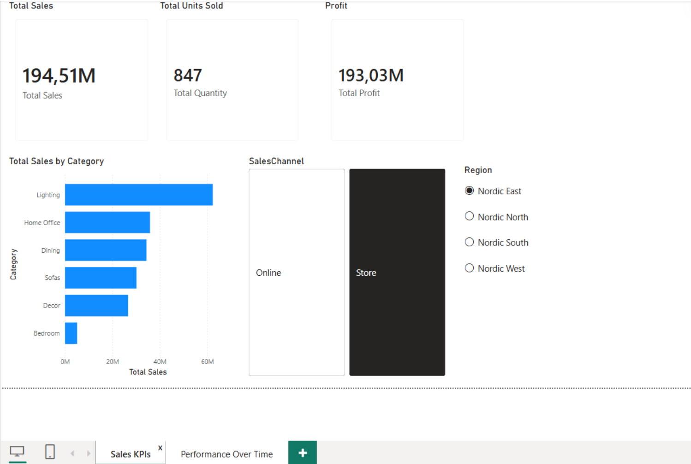
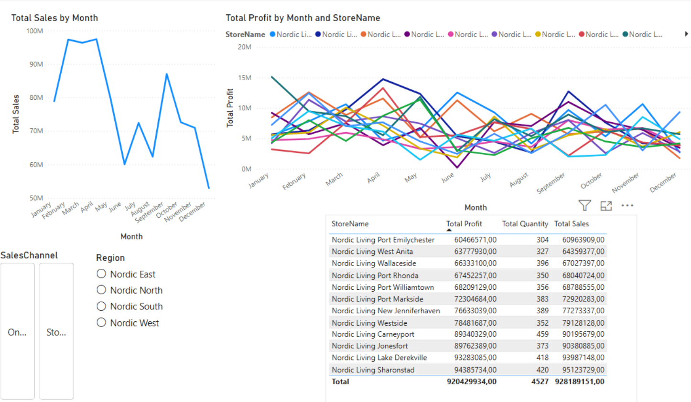

# Performance Dashboard in Power BI

## 🎯 Objective
Design a 2-page interactive Power BI dashboard to analyze retail sales metrics, track performance over time, and support data-driven decision-making.

## 🚀 Core Implementation
* **Sales KPIs Dashboard:** Designed a high-level summary page featuring KPI cards for Total Sales, Total Units Sold, and Total Profit.
* **Interactive Filtering:** Implemented cross-filtered slicers to allow users to dynamically segment data by `Region` (e.g., Nordic East, North) and `Sales Channel` (Online vs. Store).
* **Trend Analysis:** Developed a "Performance Over Time" dashboard utilizing line charts to visualize order trends by month and compare profit trajectories across different store locations.
* **Detailed Reporting:** Built a granular matrix table to break down Total Profit, Total Quantity, and Total Sales at the individual `StoreName` level.

## 📊 Visualizing the Insights

### 1. Sales KPIs
*(Overview of core metrics and dimensional slicing)*

### 2. Performance Over Time
*(Monthly trend analysis and store-level profit comparisons)*

